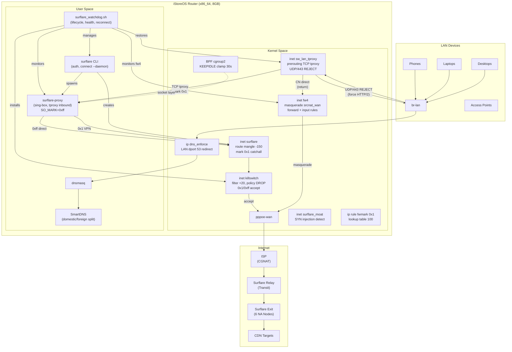
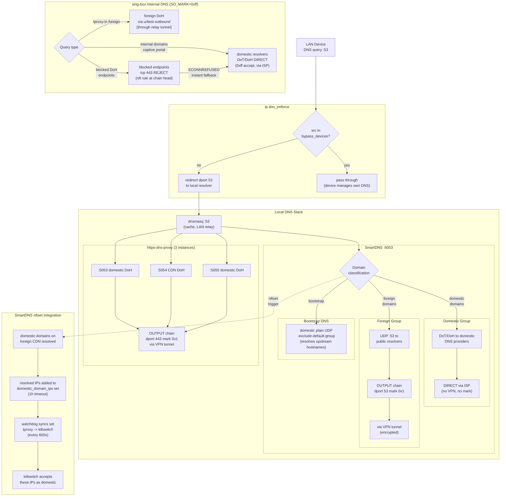
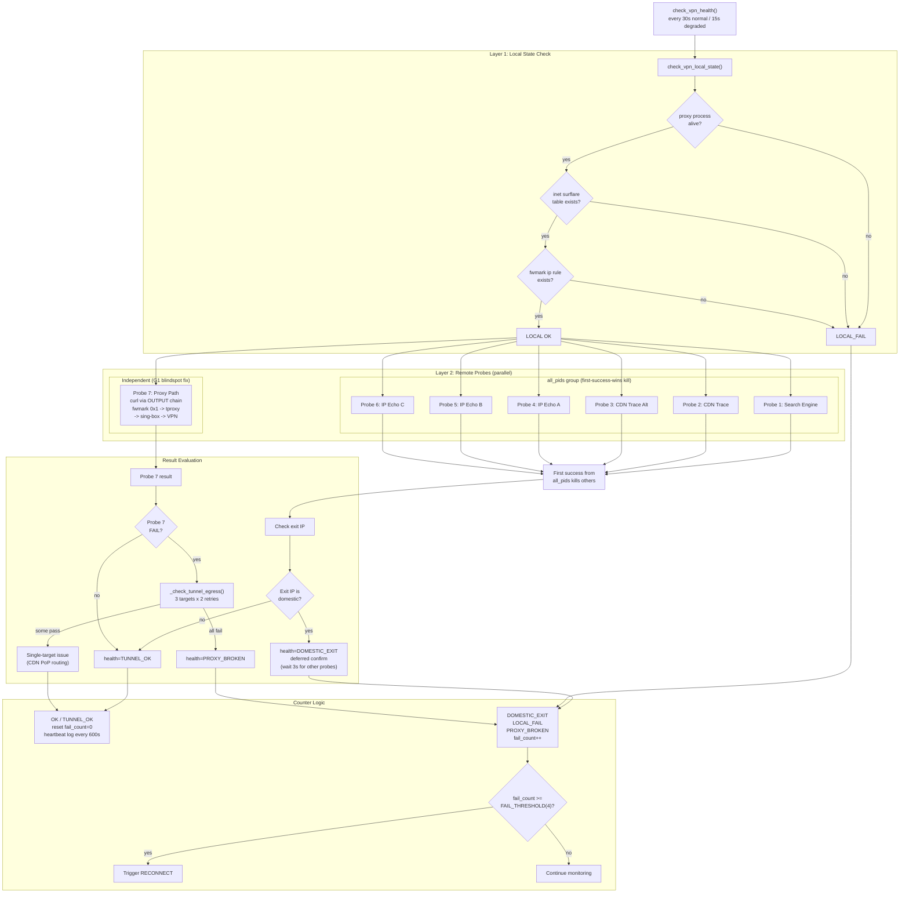
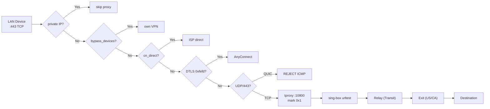

# surflare-watchdog

A resilient watchdog system for [Surflare VPN](https://www.surflare.com) on Linux.
Monitors tunnel health, rotates nodes on failure, and uses surflare-proxy's own
internal urltest results for real-time node health — zero VPN disruption required.

---

## System Architecture



**Key insight:** surflare-proxy already runs sing-box urltest outbounds for every
node and transit combination, using the local CN IP as the probe source. Errors
are logged; successes are silent (DEBUG level). `surflare_log_health.sh` reads
these errors to determine node health — no active probing, no VPN disruption.

---

## How They Work Together

### Normal operation

```
[every 3 min — cron]
surflare_log_health.sh
      |-- tail last 2MB of /var/log/surflare/surflare-proxy.log
      |-- count urltest errors per node/transit combo in last 10 min
      |-- errors > 10  => mark unhealthy
      '-- write /run/surflare_node_health.json (atomic, 0600)

[every 30s]
surflare_early_detector.sh samples ss metrics
      |-- cwnd <= 1  (+2 pts per connection)
      |-- rto > 8000 (+2 pts per connection)
      |-- backoff >= 3 (+2 pts per connection)
      '-- if total score >= 16: SIGUSR1 -> watchdog wakes immediately

[every 30s, or on SIGUSR1]
surflare_watchdog.sh health check
      |-- curl probes (2 targets, parallel, --max-time 8)
      |-- PASS: log "VPN healthy"
      '-- FAIL: _rotate_node()
                |-- reads /run/surflare_node_health.json
                |-- skips candidates with > 10 urltest errors
                '-- connect to next healthy candidate
```

### Tunnel failure and fast recovery

```
Tunnel degrades silently
      |
early_detector sees cwnd/rto/backoff worsen  (within 30s)
      |
SIGUSR1 sent to watchdog PID
      |
watchdog interrupts sleep, runs health check immediately
      |
health check fails -> _rotate_node()
      |
reads pre-computed node health, skips confirmed-dead nodes on first try
      |
connects to next healthy candidate

Before:  detect 120s + try each node serially (8s each)
After:   detect <30s + skip dead nodes immediately
```

---

## DNS Architecture



LAN devices must use the router as their DNS server. `ip dns_enforce` rejects
any direct DNS queries to external resolvers. SmartDNS splits domestic and
foreign domains: domestic queries go direct via ISP (DoT), foreign queries
are encrypted through the VPN tunnel. Resolved domestic IPs are injected into
nftsets for tproxy bypass.

---

## Three-Mode State Machine

The watchdog operates in three modes, selected by the `MODE` variable in
`/etc/surflare/mode.conf` (survives redeploy on iStoreOS overlay). Each mode
differs in which nftables tables are created and how traffic is routed.

### Mode overview

| Mode | Target | Value | Traffic path |
|------|--------|-------|-------------|
| **Router Rule** | N100 router (default) | `rule` | LAN tproxy + cn_direct POPULATED + sing-box CN split |
| **Router Global** | N100 router (alt) | `global` | LAN tproxy + cn_direct POPULATED (CN bypass at nft layer) |
| **Laptop Global** | Z66 laptop | `global` | No tproxy, no dns_enforce; local traffic only |

cn_direct is loaded in ALL modes (belt-and-suspenders with sing-box geoip,
which misses some cloud CDN APAC ranges). In rule mode, cn_direct hits go
direct via ISP; misses still reach sing-box for app-layer CN split. Laptop
Global skips LAN-facing tables entirely (no tproxy, no dns_enforce) since
there is no downstream LAN.

---

### nftables table ownership

The watchdog and the surflare binary each own specific nftables tables. This
matrix shows who creates, manages, and tears down each table.

```
+--------------------+-------------------+-----------------+-----------------+-----------------+
| Table              | Owner             | Router Rule     | Router Global   | Laptop Global   |
+--------------------+-------------------+-----------------+-----------------+-----------------+
| inet surflare      | surflare binary   | output chain    | same + watchdog | same as router  |
|                    |                   | (fwmark route)  | adds cn_ipv4/   | global          |
|                    |                   | + prerouting    | cn_ipv6 sets    |                 |
|                    |                   | (tproxy :10800) | + accept rules  |                 |
|                    |                   | + server_ports  |                 |                 |
|                    |                   | + icmp drop     |                 |                 |
+--------------------+-------------------+-----------------+-----------------+-----------------+
| inet killswitch    | watchdog          | output (policy  | same            | same            |
|                    |                   | drop, server_ips|                 |                 |
|                    |                   | /bypass)        |                 |                 |
|                    |                   | + forward (LAN  |                 |                 |
|                    |                   | protection)     |                 |                 |
+--------------------+-------------------+-----------------+-----------------+-----------------+
| inet sw_lan_tproxy | watchdog          | prerouting (LAN | same            | same as router  |
|                    |                   | TCP tproxy      |                 | global          |
|                    |                   | :10800, QUIC    |                 |                 |
|                    |                   | reject),        |                 |                 |
|                    |                   | cn_direct       |                 |                 |
|                    |                   | POPULATED       |                 |                 |
+--------------------+-------------------+-----------------+-----------------+-----------------+
| ip dns_enforce     | watchdog          | DNS enforcement | same            | NOT CREATED     |
|                    |                   | (LAN DNS thru   |                 | (laptop)        |
|                    |                   | router)         |                 |                 |
+--------------------+-------------------+-----------------+-----------------+-----------------+
| inet surflare_moat | watchdog          | FIN/RST window  | same            | same            |
|                    |                   | detection       |                 |                 |
+--------------------+-------------------+-----------------+-----------------+-----------------+
| inet fw4           | OpenWrt fw4       | masquerade +    | same            | NOT CREATED     |
|                    | service           | forward rules;  |                 | (laptop)        |
|                    |                   | watchdog        |                 |                 |
|                    |                   | monitors +      |                 |                 |
|                    |                   | auto-recovers   |                 |                 |
+--------------------+-------------------+-----------------+-----------------+-----------------+
| inet watchdog_trace| watchdog          | packet trace    | same            | same            |
|                    |                   | diagnostics     |                 |                 |
+--------------------+-------------------+-----------------+-----------------+-----------------+
| inet               | bootlock init     | boot-time       | same            | NOT CREATED     |
| surflare_boot_lock | script (S18)      | lockdown,       |                 | (laptop)        |
|                    |                   | removed by      |                 |                 |
|                    |                   | watchdog or     |                 |                 |
|                    |                   | self-destructs  |                 |                 |
|                    |                   | at 120s         |                 |                 |
+--------------------+-------------------+-----------------+-----------------+-----------------+
```

---

### Main loop state machine

The main loop runs every `CHECK_INTERVAL` (default 30s). Each iteration
follows this decision tree:

```mermaid
stateDiagram-v2
    [*] --> STOPPED

    STOPPED --> STARTUP: init script start

    state STARTUP {
        [*] --> setup_moat: _setup_kernel_moat()
        setup_moat --> cleanup: _cleanup_on_startup()
        cleanup --> dns_enforce: _ensure_dns_enforce()
        dns_enforce --> install_ks: _install_killswitch()\nfresh 0x1+0xff permanent
        install_ks --> get_isp: _get_isp_ip()
        get_isp --> [*]
    }

    STARTUP --> MAIN_LOOP

    state MAIN_LOOP {
        [*] --> check_local: detect local VPN state
        check_local --> connect: state lost
        check_local --> health_cycle: state OK
        health_cycle --> check_local: sleep CHECK_INTERVAL\n30s normal / 15s degraded
    }

    state CONNECT_VPN {
        [*] --> flush_surflare: 1. flush inet surflare
        flush_surflare --> unarm_ks: 2. delete killswitch\n(API access)
        unarm_ks --> auth: 3. refresh_auth()\nreactive, event-driven
        auth --> daemon: 4. surflare connect\n--daemon
        daemon --> rearm_ks: 5. _install_killswitch()\nfresh
        rearm_ks --> phase1: 6. Phase 1\nlocal state check\n20s timeout
        phase1 --> phase2: 7. Phase 2\ndata-plane ping\n60s timeout
        phase2 --> chnroute: 8. _setup_chnroute()
        chnroute --> tproxy: 9. _restore_tproxy()
        tproxy --> [*]
    }

    MAIN_LOOP --> CONNECT_VPN: state lost / fail_count >= 4

    state HEALTH_MONITOR {
        [*] --> local_check: Layer 1\nlocal state
        local_check --> probes: Layer 2\n7 parallel probes
        probes --> proxy_path: proxy path check\nvia tproxy
        proxy_path --> egress: tunnel egress check\n3 targets x 2 retries
        egress --> evaluate
        evaluate --> healthy: OK / TUNNEL_OK\nreset counters
        evaluate --> degraded: FAIL\nfail_count++
        degraded --> threshold: fail_count >= 4?
        threshold --> [*]: no, continue
    }

    CONNECT_VPN --> HEALTH_MONITOR: connected

    HEALTH_MONITOR --> RECONNECT: fail_count >= FAIL_THRESHOLD(4)

    state RECONNECT {
        [*] --> rotate: _rotate_node()\nround-robin candidates
        rotate --> storm_check: storm protection
        storm_check --> cooldown: 5 reconnects\nin window
        storm_check --> reconnect_vpn: under threshold
        cooldown --> reconnect_vpn: 600s cooldown\nrestore tproxy domestic bypass
        reconnect_vpn --> [*]
    }

    RECONNECT --> CONNECT_VPN: retry connection

    MAIN_LOOP --> STOP: SIGTERM / SIGINT

    state STOP {
        [*] --> stop_trace: stop_packet_trace()
        stop_trace --> teardown_nft: nftables teardown FIRST\n_full_teardown() or modular
        teardown_nft --> kill_procs: killall proxy\nsexpect, route_updater
        kill_procs --> wait_auth: auth wait\n5s timeout then SIGKILL
        wait_auth --> rm_pid: rm PIDFILE
        rm_pid --> [*]
    }

    STOP --> STOPPED: all clean
```



#### Health check detail



---

### Auth lifecycle

Authentication runs in the background to avoid blocking the main health-check
loop. Errors are classified into three categories with different retry
strategies.

```
Reactive auth (event-driven, no periodic timer):

  The surflare binary manages JWT renewal internally (detour_refresh.go).
  Watchdog only calls refresh_auth when surflare status reports auth needed.

  Triggers (in connect_vpn, before surflare connect --daemon):

    1. surflare status: "not logged in" / "session expired"
       --> refresh_auth (up to LOGIN_RETRIES=5 with backoff)
    2. surflare status: "subscription not active"
       --> log warning, 1h cooldown, do NOT refresh
    3. surflare status timeout (rc=124) or error (rc!=0)
       --> treat as auth needed, attempt refresh_auth

  Signal file IPC (connect_vpn subshell -> main loop):

    /run/surflare_auth_fail_signal: "fatal" | "retryable" | "subscription"
      "subscription" --> 1h cooldown (reconnect won't help)
      "fatal"        --> auth_fail_count = threshold
      "retryable"    --> auth_fail_count++
      threshold hit  --> force reconnect

Error classification (_classify_auth_error):

  +---------------------------+-----------+----------------------------------+
  | Pattern                   | Class     | Action                           |
  +---------------------------+-----------+----------------------------------+
  | Too Many Requests / 429   | FATAL     | immediate break, rc=2            |
  | invalid username/password | FATAL     | immediate break, rc=2            |
  | Subscription expired      | FATAL     | immediate break, rc=2            |
  | Device limit              | FATAL     | immediate break, rc=2            |
  | Account check failed      | FATAL     | immediate break, rc=2            |
  | timeout / network error   | RETRYABLE | auth_fail_count++, retry         |
  +---------------------------+-----------+----------------------------------+

  Backoff: 3s --> 6s --> 12s --> 24s --> 48s (cap 60s)
```

---

### Crash recovery (_cleanup_on_startup)

On startup (or watchdog restart), the cleanup function restores a consistent
state from any prior crash or unclean shutdown. Steps execute in order:

```
 1. Kill stale surflare-proxy holding port 10800
 2. Clean stale PID file (check if process is actually dead)
 3. Remove stale lock file (unconditional)
 4. Kill zombie surflare processes (killall -9)
 5. Detect tombstoned tproxy
      - reject rules left behind from prior crash
      - restore tproxy rules from nft file
      - Global mode: also repopulate cn_direct sets
 6. Clean orphaned watchdog_trace table
 7. Clean stale IPC files
      - /run/surflare_auth_fail_signal
      - /run/surflare_stale_warn
      - /run/surflare_auth_bg_active
 8. Flush inet surflare (binary's table)
 9. Ensure dns_enforce table (router only; skipped on laptop)
10. Clean ip rules (remove stale fwmark entries)
```

After cleanup, the watchdog proceeds to the normal main loop.

---

### Diagnostic mode (SIGUSR2)

Sending SIGUSR2 to the watchdog PID toggles diagnostic mode. This is useful
when you need to manually interact with the surflare CLI while keeping the
VPN tunnel and nftables rules alive.

```
  Normal operation               SIGUSR2 received
  +------------------+          +------------------+
  | _diag_mode = 0   | ------->| _diag_mode = 1   |
  | full health loop |          | sleep only       |
  +------------------+          +------------------+
         ^                              |
         |         SIGUSR2 again        |
         +------------------------------+

When _diag_mode=1:
  - Main loop sleeps CHECK_INTERVAL, skips all logic
  - nft tables stay active (killswitch, tproxy, moat)
  - User can run surflare CLI for manual diagnosis
  - Send USR2 again to resume normal operation
```

---

### IPC files

All IPC uses files under `/run/` (tmpfs). Writers and readers are listed
below. Crash recovery cleans stale files on startup.

```
+-----------------------------+--------------+--------------+-------------------+
| File                        | Writer       | Reader       | Cleaner           |
+-----------------------------+--------------+--------------+-------------------+
| surflare_watchdog.pid       | main loop    | USR1 trap,   | cleanup()         |
|                             | (echo $$)    | early_detect |                   |
+-----------------------------+--------------+--------------+-------------------+
| surflare_watchdog.lock      | connect_vpn  | connect_vpn  | crash recovery    |
|                             | (flock)      | (flock)      |                   |
+-----------------------------+--------------+--------------+-------------------+
| surflare_last_refresh       | auth success | stale-token  | never (persist)   |
+-----------------------------+--------------+--------------+-------------------+
| surflare_auth_fail_signal   | connect_vpn  | main loop    | crash recovery,   |
|                             | subshell     | reconnect    | reader            |
+-----------------------------+--------------+--------------+-------------------+
| surflare_stale_warn         | stale-token  | stale-token  | auth success,     |
|                             | check        | rate limit   | crash recovery    |
+-----------------------------+--------------+--------------+-------------------+
| surflare_auth_bg_active     | bg auth      | connect_vpn  | collector,        |
|                             | launch       | skip guard   | crash recovery    |
+-----------------------------+--------------+--------------+-------------------+
| surflare_detector.alive     | early_detect | main loop    | never             |
+-----------------------------+--------------+--------------+-------------------+
| surflare_watchdog.early_ack | USR1 trap    | early_detect | cleanup()         |
+-----------------------------+--------------+--------------+-------------------+
| surflare_503_state          | 503 monitor  | health check | _stop_proxy_log   |
|                             | (atomic mv)  | G2 override  | _monitor,         |
|                             |              |              | _full_teardown    |
+-----------------------------+--------------+--------------+-------------------+
```

All paths are relative to `/run/`. Files are mode 0600 and live on tmpfs
(no persistent storage needed).

---

## Components

### `surflare_watchdog.sh` -- Main daemon

| Feature | Detail |
|---|---|
| Health check | 7 parallel probes including Probe 7 (tproxy path through sing-box) |
| G1 blindspot | Probe 7 detects proxy path failure when direct probes succeed |
| G2 503 override | 503 monitor writes evidence to state file; health check overrides Probe 7 when count >= 10 within time window (ADR-0001) |
| Log-based skip | `_node_is_log_healthy()` skips nodes with recent urltest errors |
| Cascade fast-rotate | `reconnect_count >= 2` triggers rapid try of all candidates |
| Storm protection | `STORM_COOLDOWN=600s` after all candidates exhausted |
| Reconnect rate limit | Max 3 reconnects in 600s sliding window |
| Kill switch | nftables drops non-tunnel traffic while VPN is down |
| CN bypass | cn_direct (2344 CIDRs) + SmartDNS nftset (111K domains) for domestic traffic |
| BPF keepalive | Dual BPF programs clamp TCP keepalive to 30s (CGNAT NAT mapping preservation) |
| Fail-open | After 5 global auth failures, removes kill switch; retries with backoff |
| Early warn | USR1 trap wakes watchdog for immediate health check |
| fw4 health | `_check_fw4_health` every 300s, auto-recovery via `firewall reload` (preserves surflare table; restart would flush entire ruleset) |
| Instance lock | flock fd 200 prevents duplicate instances; cleanup gated on `_instance_lock_acquired` flag |

### `surflare_early_detector.sh` -- TCP degradation sensor

Polls `ss -tnp state established` every `MONITOR_INTERVAL=30s`. Scores each
surflare connection on three TCP metrics:

| Metric | Condition | Score |
|---|---|---|
| Congestion window | cwnd <= 1 | +2 pts |
| Retransmit timeout | rto > 8000 ms | +2 pts |
| Exponential backoff | backoff >= 3 | +2 pts |

When combined score reaches `DEGRADATION_THRESHOLD` (default 16), sends `SIGUSR1`
to the watchdog PID.

### `surflare_log_health.sh` -- Real-time node health monitor

Runs every 3 minutes via cron. Reads the last 2MB of
`/var/log/surflare/surflare-proxy.log` and extracts urltest error counts
for each node/transit combination.

**Why this works:** surflare-proxy (sing-box) runs urltest outbounds for all
node combinations using the local CN IP as the source. Failed probes are logged
at ERROR level; successful probes are silent. Error presence = unhealthy.
No VPN connection or disruption required.

Output: `/run/surflare_node_health.json` (mode 0600, tmpfs)

| Field | Meaning |
|---|---|
| `error_count` | urltest errors in the last 10 minutes |
| `urltest_healthy` | `error_count <= 10` |
| `last_error` | most recent error message (truncated to 120 chars) |

Watchdog uses `_node_is_log_healthy(node, transit)` to skip candidates
with `error_count > 10` during rotation. Stale file (> 20 min old) is
treated as healthy — cascade handles actual failures.

### `surflare_node_probe.sh` -- Manual diagnostic tool

**Not scheduled.** Run on demand to get a point-in-time assessment of all
configured nodes. Requires briefly disconnecting the current VPN session per
candidate (~26s per exit node, ~30s per transit node).

Records L4 TCP RTT, L7 TTFB, exit country, path-quality signals (SYN ratio,
RST injection, SACK rate), server IPs, and current urltest health status.
Results written to `/run/surflare_probe_results.json`.

---

## Dependencies

| Command | Package | Required by |
|---|---|---|
| `curl` | curl | watchdog, node_probe |
| `ss` | iproute2 | watchdog, early_detector |
| `nft` | nftables | watchdog |
| `flock` | util-linux | watchdog, node_probe |
| `pgrep` / `pkill` | procps | all |
| `python3` | python3 | log_health, node_probe |
| `surflare` / `surflare-proxy` | Surflare package | all |
| `/var/log/surflare/surflare-proxy.log` | written by surflare-proxy | log_health |

---

## Install

```bash
git clone git@github.com:HouMinXi/surflare-watchdog.git
cd surflare-watchdog
sudo bash install.sh
```

`install.sh` detects the init system (systemd / OpenRC / procd / runit), copies
scripts to `/usr/local/sbin/`, installs and enables services, and adds the
log_health cron entry.

```bash
# Auth setup (optional — TPM2-backed password storage)
sudo bash ./setup_auth.sh

# Start
sudo systemctl start surflare-watchdog
sudo systemctl start surflare-early-detector
```

---

## Configuration

**`surflare_watchdog.sh`**

```bash
NODE="Dallas"
NODE_CANDIDATES=("Dallas" "Los Angeles" "Chicago" "New York" "Atlanta" "Miami")
MODE="rule"             # externalized to /etc/surflare/mode.conf on router
TRANSIT="auto"          # surflare picks relay automatically
CHECK_INTERVAL=30       # seconds between health checks
FAIL_THRESHOLD=4        # consecutive failures before reconnect
STORM_COOLDOWN=600      # seconds after all candidates exhausted
STORM_503_OVERRIDE_COUNT=10   # 503s to override Probe 7 (ADR-0001)
STORM_503_OVERRIDE_WINDOW=300 # fast-storm window (seconds)
STORM_503_ACTIVE_WINDOW=60    # active-storm window (seconds)
```

**`surflare_early_detector.sh`**

```bash
MONITOR_INTERVAL=30       # seconds between ss samples
DEGRADATION_THRESHOLD=16  # combined score to fire SIGUSR1
COOLDOWN=300              # minimum seconds between signals
```

**`surflare_log_health.sh`**

```bash
DEFAULT_WINDOW=10   # minutes of log to scan for errors
# Called with: surflare_log_health.sh [--window-minutes N] [--out FILE]
```

---

## Usage

```bash
# Start services
sudo systemctl start surflare-watchdog
sudo systemctl start surflare-early-detector

# Live log
sudo dmesg -w | grep surflare

# Current node health (updated every 3 min by cron)
sudo python3 -m json.tool /run/surflare_node_health.json

# Manual diagnostic probe (disconnects VPN briefly)
sudo /usr/local/sbin/surflare_node_probe.sh
sudo python3 -m json.tool /run/surflare_probe_results.json
```

---

## Key Log Messages

| Message | Meaning |
|---|---|
| `VPN healthy: exit=US` | Periodic heartbeat |
| `EARLY_WARN_TRIGGERED` | Detector fired USR1; immediate health check started |
| `Node rotation: X -> Y (N/M)` | Switching to next candidate |
| `LOG_HEALTH: skipping X via Y (N errors)` | Node skipped due to recent urltest errors |
| `Storm protection triggered` | All candidates exhausted; cooling down |
| `Local VPN state lost` | Proxy process or routing rules missing |
| `G2: 503 storm override` | 503 monitor evidence overrode Probe 7; forcing reconnect |
| `503 storm: N urltest 503` | 503 monitor accumulated N errors; USR1 sent |
| `Proxy path broken` | Probe 7 or G1/G2 detected proxy failure |
| `early_detector_stale` | Detector heartbeat overdue |

---

## Supported Distributions

| Init system | Distros |
|---|---|
| systemd | Fedora, Ubuntu, Debian, Arch, RHEL, openSUSE |
| OpenRC | Alpine, Gentoo |
| procd | OpenWrt, iStoreOS (N100 router) |
| runit | Void Linux |

---

## N100 Router Deployment (iStoreOS / OpenWrt)

When deployed on an iStoreOS/OpenWrt router (procd init), `install.sh`
additionally installs a transparent proxy rule that routes **all LAN
devices** through the VPN without any per-device configuration.

### How it works



All TCP traffic from `br-lan` that is NOT destined for private addresses
(`10/8`, `172.16/12`, `192.168/16`) is intercepted and transparently
proxied through `surflare-proxy` on port 10800. surflare-proxy applies
CN bypass and node routing before forwarding.

### Extra dependency

```bash
opkg install kmod-nft-tproxy
```

Required for the `tproxy` nft action on OpenWrt kernel modules.
Not needed on standard Linux (compiled in by default).

### What install.sh does on procd

In addition to the standard binary/service installation, `install.sh`
copies `surflare-lan-tproxy.nft` to `/etc/surflare-lan-tproxy.nft`.
The watchdog loads this file via `_install_lan_tproxy()` after every VPN
connect, so the rule is automatically re-applied on reconnect or restart.

### LAN bypass mechanisms

Devices that run their own VPN (e.g. Cisco AnyConnect) must bypass tproxy
entirely. The tproxy intercepts TCP 443 and routes it through surflare-proxy,
which breaks the VPN's TLS control channel even though the DTLS data channel
(UDP 443) is independently bypassed by the `0xfefd` detection rule.

**Configuration** (`/etc/surflare/bypass-macs.conf`):

```
# One MAC per line. IPs auto-resolved from /tmp/dhcp.leases.
00:11:22:33:44:55   # admin-PC Windows (.11)
00:66:77:88:99:aa   # Mac (.147) -- Cisco AnyConnect
```

**Traffic path for bypassed devices**:

```
LAN device -> br-lan
  -> sw_lan_tproxy prerouting: ip saddr @bypass_devices return (skip tproxy)
  -> killswitch forward: ip saddr @bypass_src accept
  -> fw4 forward: forward_lan -> accept_to_wan
  -> NAT masquerade -> pppoe-wan -> WAN (direct, no VPN)
```

**fw4 masquerade dependency**: CN-direct traffic (bypassed by `sw_lan_tproxy`
`return` rules) depends on fw4's `srcnat_wan` masquerade to NAT the source IP.
Without it, replies from the CN destination route to the private LAN IP and
never arrive. The watchdog monitors this every 300s via `_check_fw4_health`
and auto-recovers using `firewall reload` (not `restart` -- `fw4 restart`
flushes the entire nftables ruleset, deleting the surflare and
`sw_lan_tproxy` tables).

**What bypass covers**: all protocols (TCP, UDP, ICMP), all destinations.
Bypassed devices are synced to killswitch `bypass_src` (forward accept) and
`dns_enforce vpn_bypass` (DNS exemption). No log pollution: `ks-fwd-mon`
is short-circuited by `bypass_src accept` before the log rule.

**DTLS-only bypass** (UDP 443 detection, no config needed):

```
iifname "br-lan" udp dport 443 @th,72,16 0xfefd return
```

Every DTLS 1.2 record carries `0xFEFD` at byte 1-2 (protocol version),
so this matches ALL DTLS packets, not just the initial handshake. QUIC
versions never have `0xFEFD` at this offset, so QUIC rejection is unaffected.
This handles the DTLS data channel but NOT the TCP control channel -- devices
that use both (like AnyConnect) need `bypass-macs.conf` entries.

### Known iStoreOS / busybox constraints

| Constraint | Reason |
|---|---|
| `table ip` not `table inet` | `inet` + `ip saddr` in tproxy causes "conflicting protocols" error |
| `tproxy ip to 127.0.0.1:10800` | Bare `tproxy to :10800` silently fails for LAN forwarded packets |
| `pgrep surflare-proxy` (no `-x`) | busybox `pgrep -x` always returns 1 (known busybox bug) |
| `pgrep -f "/usr/bin/surflare"` in `wait_for_exit` | Plain `pgrep surflare` also matches watchdog bash (comm=`surflare_watchd`) |
| `tr '\n' ','` not `paste -sd, -` | `paste` not installed on iStoreOS |
| NTP skuid detected at runtime | iStoreOS uses user `ntp`; Fedora/RHEL use `chrony` |

---

## Service Management (systemd)

### Stop and disable all services

```bash
for svc in surflare-watchdog.service surflare-early-detector.service \
            surflare-route-updater.timer surflare-update.timer; do
  sudo systemctl stop    "$svc"
  sudo systemctl disable "$svc"
done
# Clean up any remaining processes and nft tables
sudo killall surflare surflare-proxy 2>/dev/null || true
sudo nft delete table inet surflare      2>/dev/null || true
sudo nft delete table inet surflare_moat 2>/dev/null || true
sudo nft delete table inet killswitch    2>/dev/null || true
```

### Re-enable and start

```bash
sudo systemctl enable --now surflare-watchdog.service
sudo systemctl enable --now surflare-early-detector.service
sudo systemctl enable --now surflare-route-updater.timer
sudo systemctl enable --now surflare-update.timer
```

### Check status

```bash
systemctl list-units | grep surflare          # active units
systemctl list-unit-files | grep surflare     # enabled/disabled state
sudo nft list tables | grep surflare          # nft tables (should exist when VPN connected)
pgrep -af surflare                            # running processes
```
